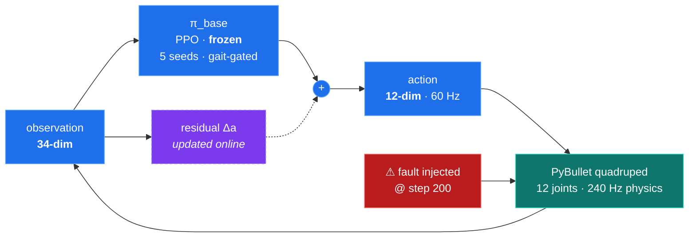

 

## ▸ 01 — About me

I'm a sophomore at **River Islands High School**, dual-enrolled at **San Joaquin Delta College**. I specialize in the **integration of AI and machine learning into engineering disciplines — mechatronics and aerospace in particular** — along with the mathematics, simulation, and control that has to hold underneath for that integration to mean anything.

I like problems that stay interesting after the first correct answer: **Is this number real, or is my instrument lying to me? Which assumption breaks first? What does the system do the moment it does?** That's why I work where ML meets hardware. A model that scores well on a benchmark and a model you would trust to run a physical system are not the same object, and the distance between them is where the engineering actually lives.

## ▸ 02 — Experience

### Student Researcher — MIT CSAIL
Member of the Computer Science and Artificial Intelligence Laboratory, assisting the development of a system that changes the way data can be visualized. The interesting part of the problem sits underneath the interface: what a system has to compute, and how it has to represent what it knows, before a person can look at the result and see something they couldn't see before.

### Student Researcher — UC Santa Cruz
Machine learning applications in robotics, and what it actually takes to move them into the real world. My current project asks whether a quadruped can recover its gait after an actuator or sensor fault by learning a small correction online — without retraining the policy underneath. So far the work has been as much about building trustworthy measurement as building the method: the first substantive result was discovering that the recovery criterion was crediting recoveries that never happened.

### Research Fellow — Lumiere Education
Conducting an independent research project under the mentorship of Fernanda-Maria Lugo-Bolanos of Brown University. I was accepted into the program with a merit-based scholarship for a revolutionary research idea proposal video. In this project, I am currently investigating whether a skin lesion classifier trained on the ISIC dataset relies genuinely on actual lesion features or inadvertently keys off confounding artifacts like surgical ink marks, rulers, and hair.

## ▸ 03 — Active research

### `Fault Recovery in RL Locomotion Through Online Residual Adaptation`
**UC Santa Cruz · AIEA Lab**

*Can a small correction module, updated* ***during*** *execution, restore a quadruped's gait after a hardware fault — without retraining the policy underneath?*

### The loop

The seized joint **stays seized.** The residual redistributes the gait around it:

$$a_t \;=\; \underbrace{\pi_{\text{base}}(o_t)}_{\text{frozen}} \;+\; \underbrace{\Delta_\theta(o_t)}_{\text{online}}, \qquad \theta \leftarrow \theta - \eta\,\nabla_\theta \mathcal{L}\big(\tau_{t-k:t}\big)$$

Measured against two bounds — **no adaptation** (Baseline A) and **full retraining** (Baseline B).

## ▸ 04 — Toolchain

<table>
<tr><td><b>Languages</b></td><td>

</td></tr>
<tr><td><b>ML & research</b></td><td>

</td></tr>
<tr><td><b>Web & systems</b></td><td>

</td></tr>
<tr><td><b>Mechatronics & CAD</b></td><td>

</td></tr>
<tr><td><b>Writing</b></td><td>

</td></tr>
</table>

## Let's build something.

Open to **research collaborations** and **AI/ML internships**.

`robotics` · `machine learning` · `mathematics` · `research` · `CAD`

 

***"Anyone can make it work once. Engineering is knowing which assumption breaks first — and what the system does the moment it does."***

